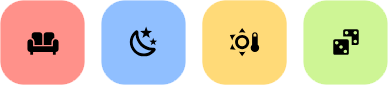
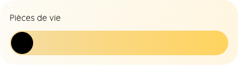
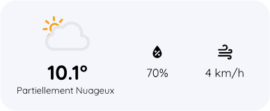
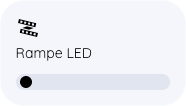

# Mon dashboard Rounded
Voici mon dashboard Home Assistant pour smartphone.

<p align="left">
  
  
</p>

Je n’ai rien inventé, je m’inspire et je prends des idées que je modifie si besoin, mais pour résumer :
- Le thème principal est [**Rounded**](https://community.home-assistant.io/t/rounded-dashboard-guide/543043) de **Leon**, que j’ai très légèrement modifié.
- Pour compléter le thème, voir aussi les travaux de [**jimmy-landry**](https://https://github.com/jimmy-landry) et [**Tamper Evident**](https://www.youtube.com/@dontuseiftamperevident).
- La barre de navigation vient à la base de [**My Smart Home**](https://www.youtube.com/watch?v=q8spkVPQiL0).

Le dashboard est composé de 5 pages :

1. **Home** : la page principale, avec les informations importantes comme la température de la pièce de vie, son CO₂, et la possibilité de contrôler les lumières, prises, volets, portail extérieur. Les grosses icônes de couleur lancent des scènes.
2. **Consommation** : pour consulter la consommation électrique de la maison, et de plusieurs appareils.
3. **BambuLab** : permet de contrôler l’imprimante 3D et d’avoir un aperçu du print en cours.
4. **Eve** : pour contrôler l’aspirateur robot.
5. **Systèmes** : pour consulter des informations sur le Raspberry Pi ou encore le Synology.

## Apercu

<p align="left">
  
</p>

## Cartes

### Titre :
<p align="left">
  
</p>

<details><summary>Code</summary>

```yaml
type: custom:button-card
name: Home
styles:
  card:
    - background: none
    - padding: 16px 0
  name:
    - font-size: 32px
    - color: var(--contrast20)
```

</details>

### Scènes :
<p align="left">
  
</p>

<details><summary>Code</summary>

```yaml
square: true
type: grid
cards:
  - type: custom:button-card
    icon: mdi:sofa
    aspect_ratio: 1/1
    tap_action:
      action: call-service
      service: scene.turn_on
      haptic: medium
      service_data:
        entity_id: scene.soiree_tv
    styles:
      card:
        - border-radius: 24px
        - background-color: var(--red)
      icon:
        - color: var(--black)
  - type: custom:button-card
    icon: mdi:weather-night
    aspect_ratio: 1/1
    tap_action:
      action: call-service
      service: scene.turn_on
      haptic: medium
      service_data:
        entity_id: scene.dodo
    styles:
      card:
        - border-radius: 24px
        - background-color: var(--blue)
      icon:
        - color: var(--black)
  - type: custom:button-card
    icon: mdi:sun-thermometer-outline
    aspect_ratio: 1/1
    tap_action:
      action: call-service
      service: scene.turn_on
      haptic: medium
      service_data:
        entity_id: scene.volets_entrouverts
    styles:
      card:
        - border-radius: 24px
        - background-color: var(--yellow)
      icon:
        - color: var(--black)
  - type: custom:button-card
    icon: mdi:dice-multiple
    aspect_ratio: 1/1
    tap_action:
      action: call-service
      service: scene.turn_on
      haptic: medium
      service_data:
        entity_id: scene.soiree_jeux
    styles:
      card:
        - border-radius: 24px
        - background-color: var(--green)
      icon:
        - color: var(--black)
columns: 4
```
</details>

### Groupe de lumières :
<p align="left">
  
</p>

<details><summary>Code</summary>

```yaml
type: custom:button-card
name: Pièces de vie
custom_fields:
  slider:
    card:
      type: custom:my-slider-v2
      entity: light.salon
      colorMode: brightness
      styles:
        container:
          - border-radius: 100px
          - overflow: visible
          - background: none
        card:
          - height: 40px
          - padding: 0 20px
          - background: var(--brightness)
        track:
          - overflow: visible
          - background: none
        progress:
          - background: none
        thumb:
          - background: var(--black)
          - top: 2px
          - right: "-18px"
          - height: 36px
          - width: 36px
          - border-radius: 100px
styles:
  grid:
    - grid-template-areas: "\"n\" \"slider\""
    - grid-template-columns: 1fr
    - grid-template-rows: 1fr min-content min-content
  card:
    - background: var(--brightness-tint)
    - padding: 16px
    - "--mdc-ripple-press-opacity": 0
  name:
    - justify-self: start
    - font-size: 14px
    - margin: 4px 0 12px 0
    - color: var(--contrast20)
```
</details>

### Météo :
<p align="left">
  
</p>

<details><summary>Code</summary>

```yaml
type: custom:button-card
entity: weather.xxx
show_name: false
show_icon: false
custom_fields:
  temp: |
    [[[
      return states['weather.xxx'].attributes.temperature + '°'
    ]]]
  cond: |
    [[[
      var time = states["weather.xxx"].state
      let welcome = '';
      if (time == 'clear-night'){
        welcome = 'Nuit dégagée';
      } else if (time == 'clear'){
        welcome = Ensoleillé;
      } else if (time == 'partlycloudy'){
        welcome = 'Partiellement nuageux';
      } else if (time == 'lightning-rainy'){
        welcome = 'Orage pluvieux';
      } else if (time == 'cloudy'){
        welcome = 'Nuageux';
      } else if (time == 'rainy'){
        welcome = 'Pluvieux';
      } else if (time == 'lightning'){
        welcome = 'Orageux';
      } else if (time == 'sunny'){
        welcome = 'Ensoleillé';
      } else {
        welcome = states["weather.xxx"].state;
      }
      return welcome;
    ]]]
  icon: |
    [[[
      var weather = states["weather.xxx"].state
      let welcome = '';
      if (states['weather.xxx'].state == 'partlycloudy') {
        return ''
      } else if (states['weather.xxx'].state == 'lightning') {
        return ''
      } else if (states['weather.xxx'].state == 'lightning-rainy') {
        return ''
      } else if (states['weather.xxx'].state == 'sunny') {
        return ''
      } else if (states['weather.xxx'].state == 'rainy') {
        return ''
      } else {
        return ''
      }
      return welcome;
    ]]] 
  icon2: |
    [[[
      return '<ha-icon icon="mdi:water-percent" style="width:26px; height: 26px;"> </ha-icon>'
    ]]]
  prec: |
    [[[
      return states["weather.xxx"].attributes.humidity + '%'
    ]]]
  icon3: |
    [[[
      return '<ha-icon icon="mdi:weather-windy" style="width:26px; height: 26px;"> </ha-icon>'
    ]]]
  wind: |
    [[[
      let myNumber = states["weather.xxx"].attributes.wind_speed;
      let roundedNumber = `${Math.round(myNumber)} km/h`;
      return roundedNumber;
    ]]]
styles:
  grid:
    - grid-template-rows: 33% auto% 33%
    - grid-template-columns: 50% 25% 25%
    - grid-template-areas: |
        "icon icon2 icon3"
        "temp prec wind"
        "cond . ."
  card:
    - height: 120pt
  custom_fields:
    icon:
      - margin-top: 3%
    temp:
      - font-size: 22pt
      - font-weight: 700
    cond:
      - font-size: 10pt
      - margin-bottom: 3%
      - margin-left: "-3%"
      - text-transform: capitalize
    icon2:
      - margin-left: "-35%"
      - margin-top: 50%
    prec:
      - margin-left: "-34%"
    icon3:
      - margin-left: "-35%"
      - margin-top: 50%
    wind:
      - margin-left: "-34%"

```
</details>

### Lumière :
<p align="left">
  
</p>

<details><summary>Code</summary>

```yaml
type: custom:button-card
template: light_color
entity: light.rampe_led
icon: mdi:led-strip-variant
```

</details>

<details><summary>Template</summary>

```yaml
  light_color:
    icon: '[[[ return entity.attributes.icon ]]]'
    tap_action:
      action: toggle
      haptic: medium
    hold_action:
      action: more-info
      haptic: medium
    custom_fields:
      slider:
        card:
          type: custom:my-slider-v2
          entity: '[[[ return entity.entity_id ]]]'
          colorMode: brightness
          styles:
            container:
              - background: none
              - border-radius: 100px
              - overflow: visible
            card:
              - height: 16px
              - padding: 0 8px
              - background: |
                  [[[
                    if (entity.state == "on") return "linear-gradient(90deg, rgba(255,255,255, 0.3) 0%, rgba(255,255,255, 1) 100%)";
                    else return "var(--contrast4)";
                  ]]]
            track:
              - overflow: visible
              - background: none
            progress:
              - background: none
            thumb:
              - background: |
                  [[[
                    if (entity.state == "on") return "var(--black)";
                    if (entity.state == "off") return "var(--contrast20)";
                    else return "var(--contrast8)";
                  ]]]
              - top: 2px
              - right: '-8px'
              - height: 12px
              - width: 12px
              - border-radius: 10px
    styles:
      grid:
        - grid-template-areas: '"i" "n" "slider"'
        - grid-template-columns: 1fr
        - grid-template-rows: 1fr min-content min-content
      card:
        - background: var(--contrast2)
        - padding: 16px
        - '--mdc-ripple-press-opacity': 0
      img_cell:
        - justify-self: start
        - width: 24px
      icon:
        - width: 24px
        - height: 24px
        - color: var(--contrast8)
      name:
        - justify-self: start
        - font-size: 14px
        - margin: 4px 0 12px 0
        - color: var(--contrast8)
    state:
      - value: 'on'
        styles:
          card:
            - background: |
                [[[
                    var color = entity.attributes?.rgb_color;
                    if (entity.state != "on"){
                      return 'var(--contrast20)';
                    }
                    else if (color){
                      return 'rgba(' + color + ')'
                    }
                    else{
                      return 'var(--yellow)'
                    }
                ]]]
          icon:
            - color: var(--black)
          name:
            - color: var(--black)
      - value: 'off'
        styles:
          icon:
            - color: var(--contrast20)
          name:
            - color: var(--contrast20)
```

</details>

## Don 

Si tu veux m'offrir une petite bière ou un café, c'est par ici ! Merci ❤️
 
[](https://paypal.me/spl4sh57) 
